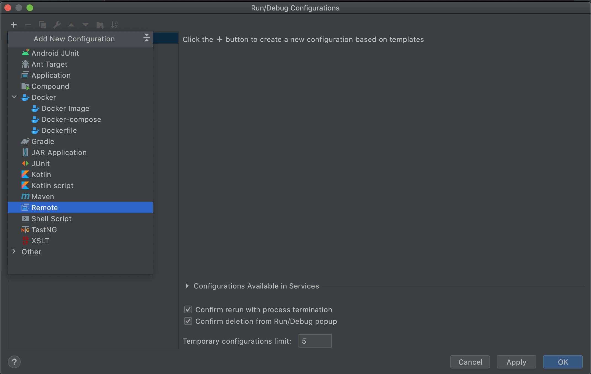

# Contributor Onboarding

Thank you for taking the time to contribute to Azure Functions in [Java](https://go.java/)

This project has adopted the [Microsoft Open Source Code of Conduct](https://opensource.microsoft.com/codeofconduct/). For more information see the [Code of Conduct FAQ](https://opensource.microsoft.com/codeofconduct/faq/) or contact [opencode@microsoft.com](mailto:opencode@microsoft.com) with any additional questions or comments.

## Table of Contents

- [Contributor Onboarding](#contributor-onboarding)
  - [Table of Contents](#table-of-contents)
  - [What should I know before I get started](#what-should-i-know-before-i-get-started)
  - [Pre-requisites](#pre-requisites)
  - [Pull Request Change flow](#pull-request-change-flow)
  - [Development Setup](#development-setup)
    - [Visual Studio Code Extensions](#visual-studio-code-extensions)
    - [Setting up the  end-to-end debugging environment](#setting-up-the-end-to-end-debugging-environment)
  - [Pre Commit Tasks](#pre-commit-tasks)
    - [Running unit tests](#running-unit-tests)
  - [Continuous Integration Guidelines & Conventions](#continuous-integration-guidelines--conventions)
  - [Getting help](#getting-help)
    - [Requesting a release](#requesting-a-release)

## What should I know before I get started

- [Azure Functions Java Quickstart](https://docs.microsoft.com/en-us/azure/azure-functions/functions-create-first-azure-function-azure-cli?tabs=bash%2Cbrowser&pivots=programming-language-java)
- [Azure Function Java developer guide](https://docs.microsoft.com/en-us/azure/azure-functions/functions-reference-java?tabs=consumption)

## Pre-requisites

- OS
  - MacOS, Ubuntu (or) Windows10
- IDE
  - [IntelliJ](https://www.jetbrains.com/idea/download)
  - [Java extension in VS Code](https://code.visualstudio.com/docs/languages/java)
- Java Tools
  - [Maven](https://maven.apache.org/install.html)
  - [JDK (Azul Zulu for Azure) 8](https://www.azul.com/downloads/azure-only/zulu/?version=java-8-lts&architecture=x86-64-bit&package=jdk) - this also installs Java 1.8 JRE
- Azure Tools
  - [Azure Storage Emulator](https://docs.microsoft.com/en-us/azure/storage/common/storage-use-emulator) (or) [Create a storage account in Azure](https://docs.microsoft.com/en-us/azure/storage/common/storage-account-create?tabs=azure-portal)
  - [Azure Functions Core Tools](https://github.com/Azure/azure-functions-core-tools) v2.7.x and above.
  - [Azure Storage Explorer](https://azure.microsoft.com/en-us/features/storage-explorer/)
  
## Pull Request Change flow

The general flow for making a change to the library is:

1. 🍴 Fork the [worker](https://github.com/Azure/azure-functions-java-worker) repo (add the fork via `git remote add me <clone url here>`
2. 🌳 Create a branch for your change (generally branch from dev) (`git checkout -b my-change`)
3. 🛠 Make your change
4. ✔️ Test your change
5. ⬆️ Push your changes to your fork (`git push my-change`)
6. 💌 Open a PR to the dev branch. Repo owner will run the current CI pipeline.
7. 📢 Address feedback and make sure tests pass (yes even if it's an "unrelated" test failure)
8. 📦 [Rebase](https://git-scm.com/docs/git-rebase) your changes into  meaningful commits (`git rebase -i HEAD~N` where `N` is commits you want to squash)
9. :shipit: Rebase and merge (This will be done for you if you don't have contributor access)
10. ✂️ Delete your branch (optional)

## Development Setup

### Visual Studio Code Extensions

The following extensions should be installed if using Visual Studio Code for debugging:

- [Java debugging for Visual Studio Code](https://marketplace.visualstudio.com/items?itemName=vscjava.vscode-java-debug) (Java for VSCode extension)
- Azure Functions Extensions for Visual Studio Code v0.19.1 and above.

### Setting up the end-to-end development environment

The following steps outline an end to end development environment to enable developers to debug all the way from the Azure Functions Host to the Java Worker when a Java Azure Function is invoked:

1. Use any [Java Azure Function starter sample](https://docs.microsoft.com/en-us/azure/azure-functions/functions-create-first-azure-function-azure-cli?tabs=bash%2Cbrowser&pivots=programming-language-java) and run *`mvn clean package`* to produce the target executable of a Java Azure Function.

1. Git clone the [Azure function host](https://github.com/Azure/azure-functions-host) code base open it using your favorite IDE.

1. Navigate to `WebJobs.Script.WebHost` project

1. Right click on `WebJobs.Script.WebHost` project and add the following environment variables into your debugging configuration:

    | Variable   |  Value    |
    | :--------: | :------:  |
    | FUNCTIONS_WORKER_RUNTIME       | java |
    | languageWorkers:java:arguments | -agentlib:jdwp=transport=dt_socket,server=y,suspend=n,address=5005 |
    | AZURE_FUNCTIONS_ENVIRONMENT    | Development |
    | AzureWebJobsScriptRoot         | a path to your azure function target folder from step 1,i.e. ~/< your-folder-path >/target/azure-functions/<azure-function-name-####> |

    >> Notes
    - In macOS, you might need to add JAVA_HOME as a debugging environment variable.
    - If using Visual Studio Code, then add these environment variables in the launch.json in the `env` object under `configurations`.

    Here is a sample configuration for Visual Studio Code

    ```json
      "env" : {
        "JAVA_HOME" : "/Library/Java/JavaVirtualMachines/zulu-8.jdk/Contents/Home",
        "FUNCTIONS_WORKER_RUNTIME":"java",

        "languageWorkers:java:arguments": "-agentlib:jdwp=transport=dt_socket,server=y,suspend=n,address=5005",

        "AZURE_FUNCTIONS_ENVIRONMENT": "Development",

        "AzureWebJobsScriptRoot" : "<path_to_java_function>/java-functions-di/java-starter/functions-di/target/azure-functions/functions-di-20201102134253063"
      }
    ```

    - Also add the following in the tasks.json file to point to your azure functions folder. Here is a sample tasks.json file

    ```json
    {
    "version": "2.0.0",
    "tasks": [
        {
            "label": "build",
            "command": "dotnet",
            "type": "process",
            "args": [
                "build",
                "<path_to_host_cloned_repo>/azure-functions-host/src/WebJobs.Script.WebHost/WebJobs.Script.WebHost.csproj",
                "/property:GenerateFullPaths=true",
                "/consoleloggerparameters:NoSummary"
            ],
            "problemMatcher": "$msCompile"
        },
        {
            "type": "func",
            "command": "host start",
            "problemMatcher": "$func-watch",
            "isBackground": true,
            "options": {
                "cwd": "<path_to_java_function>/java-functions-di/java-starter/functions-di/target/azure-functions/functions-di-20201102134253063"
            }
        }
      ]
    }
    ```

1. Navigate to `azure-functions-host/src/WebJobs.Script/Workers/ProcessManagement/WorkerProcess.cs` class and add breakpoint at `_process.Start()`.

   >> Note: Make sure that WebJobs.Script.WebHost is set as a Startup Project

1. Now in another IDE instance, git clone your fork for [azure function worker](https://github.com/Azure/azure-functions-java-worker) and open it.

1. Add new remote debugging configuration. 

  Here is a sample configuration for IntelliJ IDEA 




With this you have completed the setup for Azure Functions Host and the Azure Functions Java Worker Development.

### Start Debugging

1. Run the azure-functions-host from Step 5 in debugging mode (.NET Core Launch Debug). Wait until it stops at the `_process.Start()` breakpoint. At this point, the host is started and the java language worker needs to connect to the host.

1. Navigate to `azure-functions-java-worker/src/main/java/com/microsoft/azure/functions/worker/JavaWorkerClient.java` and add a breakpoint in the constructor. Click the Remote Debugging configured in Step 7. This connects the worker process to the host and runs worker in debugging mode.

1. Run through the breakpoint in the host until it hits the breakpoint in `JavaWorkerClient.java`. At this point the worker and host are up and running with your function app (this was configured as part of the environment variables above)

1. Open a browser and invoke the HTTP Trigger and it will reach the `execute` method in `azure-functions-java-worker/src/main/java/com/microsoft/azure/functions/worker/broker/JavaMethodExecutorImpl.java` and can then follow along the execution of the function from here.

### Testing a new version of the Java Worker

- In case you need to test a new version from Java worker code, you'll need to:

  - Compile the worker `mvn clean package -Dmaven.javadoc.skip=true -Dmaven.test.skip -Dorg.slf4j.simpleLogger.log.org.apache.maven.cli.transfer.Slf4jMavenTransferListener=warn -B`

  - Navigate to target folder and rename `azure-functions-java-worker-1.8.0.jar` to `azure-functions-java-worker.jar`

  - Copy the jar file to the debug folder in the host code base(<Azure_Function_Host_Path>/azure-functions-host/src/WebJobs.Script.WebHost/bin/Debug/netcoreapp3.1/workers/java)

  - Restart host debugger

### Running unit tests

1. Add your unit tests under ./src/test folder
2. Run: `mvn clean package`

## Getting help

- Leave comments on your PR and @username for attention

### Requesting a release

- If you need a release into maven central, request it by raising an issue and tagging @TsuyoshiUshio and @amamounelsayed
