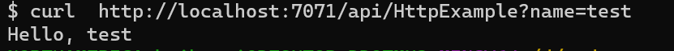
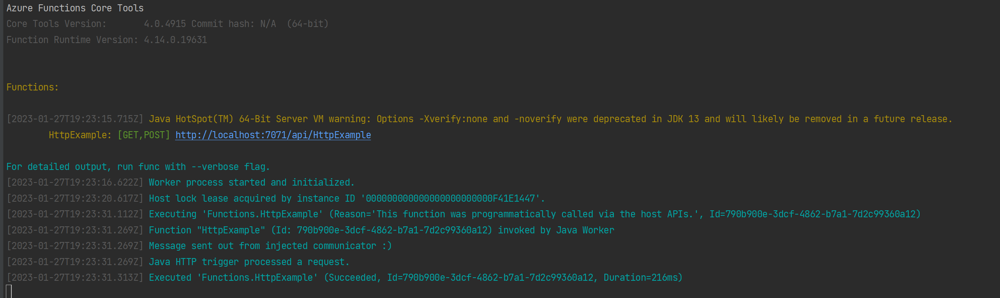

# azure-function-guice
Integration Google Guice with Azure Functions

Utilize [com.microsoft.azure.functions.spi.inject.FunctionInstanceInjector](https://github.com/Azure/azure-functions-java-additions/blob/dev/azure-functions-java-spi/src/main/java/com/microsoft/azure/functions/spi/inject/FunctionInstanceInjector.java) provided by azure functions java worker to integrate Google Guice framework into Azure Java Function. 

## Local Setup
1. Clone the repo
2. Enter corresponding directory and run `mvn clean package` to build the project
3. Run `mvn azure-functions:run` to run the project on local.
   Local example:

4. Run `mvn azure-functions:deploy` to deploy the function app, for more info about deploy azure function java app please refer to [deploy java function app](https://learn.microsoft.com/en-us/azure/azure-functions/create-first-function-cli-java?tabs=bash%2Cazure-cli%2Cbrowser#deploy-the-function-project-to-azure)